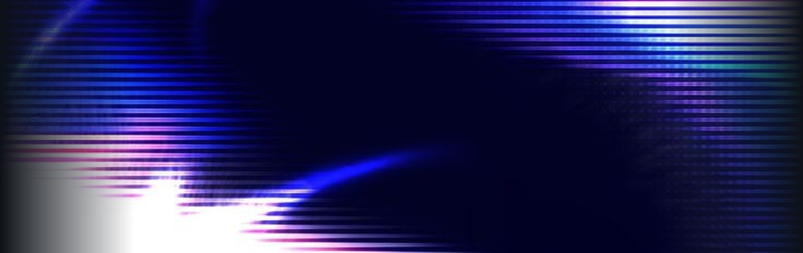

<div align="center">

  <!-- TOP HEADER BANNER -->
  

  <br/><br/>

  <!-- NAVIGATION BUTTONS / BADGES -->
  <a href="https://github.com/vaishnavi-ctrl-jpg">
    
  </a>
  &nbsp;
  <a href="https://linkedin.com/in/vaishnavi">
    
  </a>
  &nbsp;
  <a href="mailto:vaishnavi@example.com">
    
  </a>
  &nbsp;
  <a href="#">
    
  </a>

</div>

<br/>

<!-- MAIN PROFILE HERO CARD (TWO-COLUMN RESPONSIVE LAYOUT) -->
<table width="100%">
  <tr>
    <td width="60%" valign="top">

### › Hey there! I'm Vaishnavi 👋

#### **React Developer & AI/DS Undergrad** *(Class of 2026)*

I am deeply passionate about crafting minimalist, high-performance web applications, retro-cyber visual aesthetics, and building efficient automated workflows.

Currently, I'm focusing my energy on building privacy-centric platforms, local AI deployments, and orchestrating automated pipelines to automate myself out of manual labor.

My technical playground revolves around **React**, **Next.js**, **TypeScript**, **Tailwind CSS**, local AI deployments, and backend automation pipelines.

<br/>

```gcode
[SYSTEM WARNING]
// Memory Thread: unstable
// Self-state mismatch detected
// echo("who are you?") -> vaishnavi-ctrl-jpg
[CRITICAL FAULT 078]: perception overflow
[RECOVERY COMPLETE] > identity_restored()
```

  </td>
  <td width="40%" align="center" valign="middle">
    
  </td>
</tr>
</table>

<!-- SMOOTH GLOW WAVE DIVIDER -->


<br/>

## 🛠️ **Tech Stack & Tools**

<div align="center">

  <!-- LANGUAGES -->
  
  &nbsp;
  
  &nbsp;
  
  &nbsp;
  
  &nbsp;
  

  <br/><br/>

  <!-- FRAMEWORKS & LIBRARIES -->
  
  &nbsp;
  
  &nbsp;
  
  &nbsp;
  
  &nbsp;
  

  <br/><br/>

  <!-- TOOLS & DATABASES -->
  
  &nbsp;
  
  &nbsp;
  
  &nbsp;
  
  &nbsp;
  

</div>

<br/>

<!-- SMOOTH GLOW WAVE DIVIDER -->


<br/>

## 📊 **GitHub Analytics & Visual Card**

<table width="100%">
  <tr>
    <td width="55%" align="center" valign="middle">
      
    </td>
    <td width="45%" align="center" valign="middle">
      
    </td>
  </tr>
</table>

<br/>

<div align="center">
  
</div>

<br/>

<!-- SMOOTH GLOW WAVE DIVIDER -->


<br/>

<div align="center">
  <sub>Designed with 💜 for <b>vaishnavi-ctrl-jpg</b></sub>
</div>
