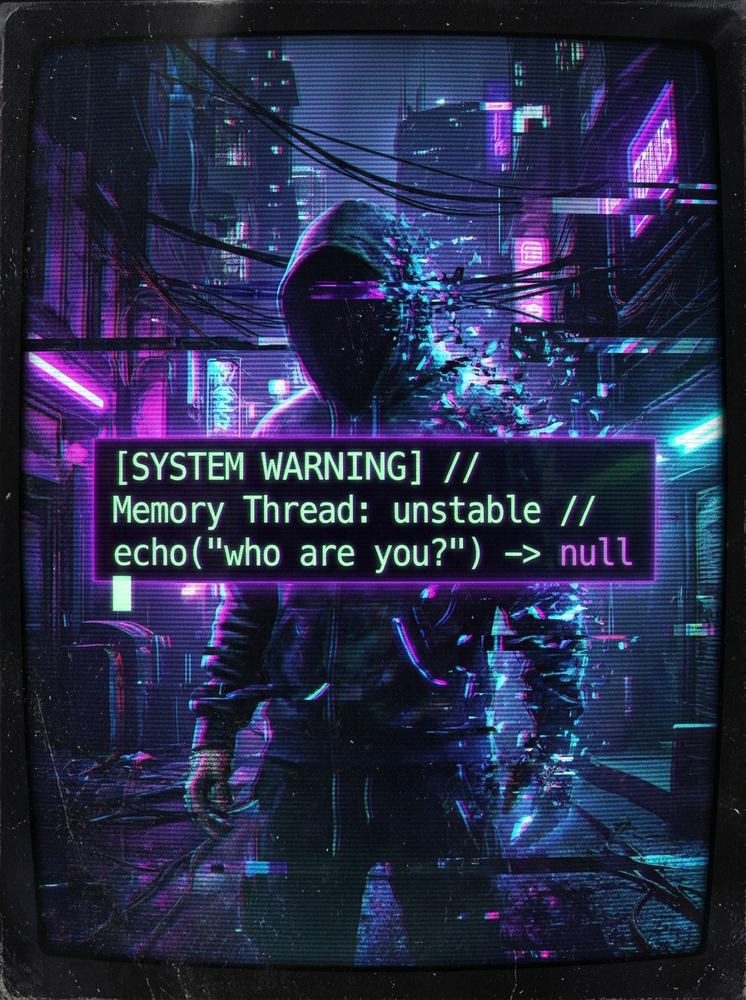

<div align="center">

  <!-- TOP HEADER BANNER -->
  

  <br/><br/>

  <!-- NAVIGATION BADGES / BUTTONS -->
  <a href="https://github.com/vaishnavi-ctrl-jpg">
    
  </a>
  &nbsp;
  <a href="https://linkedin.com/in/vaishnavi">
    
  </a>
  &nbsp;
  <a href="mailto:vaishnavi@example.com">
    
  </a>
  &nbsp;
  <a href="#">
    
  </a>

</div>

<br/>

<!-- MAIN PROFILE CARD (TWO-COLUMN RESPONSIVE TABLE) -->
<table width="100%">
  <tr>
    <td width="62%" valign="top">

### › Hey there! I'm Vaishnavi 👋

#### **Full-Stack Developer & AI/DS Undergrad** *(Class of 2026)*

I am deeply passionate about crafting minimalist, high-performance web applications and building efficient automated workflows.

Currently, I'm focusing my energy on building autonomous AI platforms, web automation tools, and full-stack solutions. My technical playground revolves around **React**, **TypeScript**, **Tailwind CSS**, local AI deployments, and orchestrating serverless pipelines to automate manual labor.

```
[SYSTEM WARNING]
// Memory Thread: active
// Self-state mismatch detected
// echo("who are you?") -> vaishnavi-ctrl-jpg
[CRITICAL FAULT 078]: perception overflow
[RECOVERY COMPLETE] > identity_restored()
```

  </td>
  <td width="38%" align="center" valign="middle">
    
  </td>
</tr>
</table>

<!-- DIVIDER BAR -->


<br/>

## 🛠️ **Tech Stack & Tools**

<div align="center">

  <!-- LANGUAGES -->
  
  
  
  
  

  <br/><br/>

  <!-- FRAMEWORKS & LIBRARIES -->
  
  
  
  
  

  <br/><br/>

  <!-- TOOLS & DATABASES -->
  
  
  
  
  

</div>

<br/>

## 📊 **GitHub Statistics**

<div align="center">

  
  &nbsp;
  

  <br/><br/>

  

</div>

<br/>

<!-- CYBER IDENTITY ARTWORK SECTION -->
<details>
  <summary><b>👾 [SYSTEM_LOG] / Identity & Glitch Protocol</b></summary>
  <br/>
  <div align="center">
    
  </div>
</details>

<br/>

<div align="center">
  <sub>Designed with ⚡ for vaishnavi-ctrl-jpg</sub>
</div>
