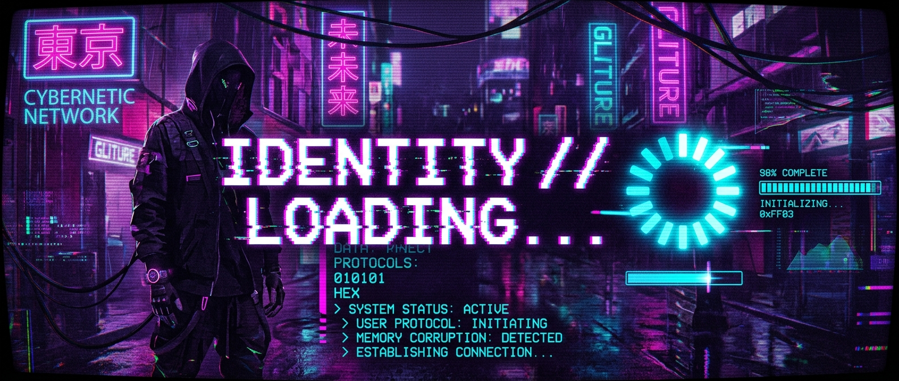
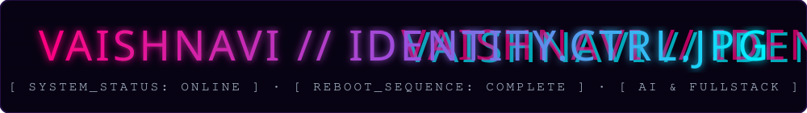
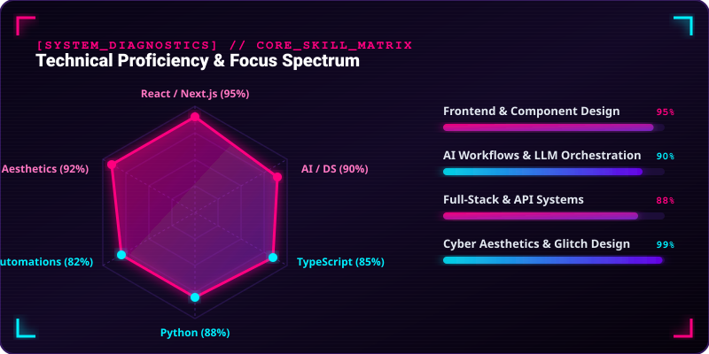
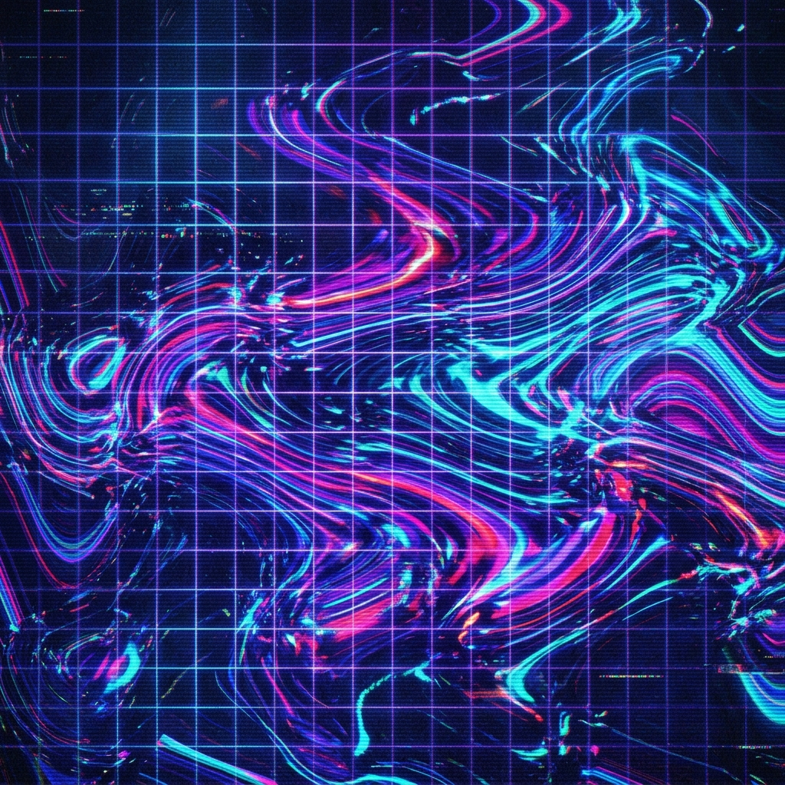

<div align="center">

  <!-- TOP CYBER GLITCH HEADER BANNER -->
  

  <br/><br/>

  <!-- CUSTOM SVG GLITCH TITLE -->
  

  <br/><br/>

  <!-- PINTEREST AESTHETIC NAVIGATION BUTTONS -->
  <a href="https://github.com/vaishnavi-ctrl-jpg">
    
  </a>
  &nbsp;
  <a href="https://linkedin.com/in/vaishnavi">
    
  </a>
  &nbsp;
  <a href="mailto:vaishnavi@example.com">
    
  </a>
  &nbsp;
  <a href="#">
    
  </a>
  &nbsp;
  <a href="https://pinterest.com">
    
  </a>

</div>

<br/><br/>

<!-- HERO SECTION: TWO-COLUMN MAIN CARD -->
<table width="100%">
  <tr>
    <td width="58%" valign="top">

### › Hey there! I'm Vaishnavi 👋 

> *"Everything feels blurred, like I only exist halfway... drifting through code I love to define."*

#### ⚡ **Full-Stack Developer & AI/DS Undergrad** *(Class of 2026)*

I am deeply passionate about crafting minimalist, high-performance web applications, retro-cyber visual aesthetics, and building autonomous AI workflows.

Currently, I'm focusing my energy on building privacy-centric platforms, local AI deployments, and orchestrating automated pipelines to automate myself out of manual labor.

```gcode
[SYSTEM WARNING]
// Memory Thread: unstable
// Self-state mismatch detected
// echo("who are you?") -> vaishnavi-ctrl-jpg
[CRITICAL FAULT 078]: perception overflow
[RECOVERY SUCCESS] > restore_identity() -> SUCCESS
```

  </td>
  <td width="42%" align="center" valign="middle">
    
  </td>
</tr>
</table>

<!-- SCANLINE GRADIENT DIVIDER -->


<br/>

## 🎯 **Core Skill Matrix & Diagnostics**

<div align="center">
  <!-- CUSTOM SVG DIAGNOSTIC RADAR & PROGRESS CHART -->
  
</div>

<br/><br/>

## 🛠️ **Tech Stack & Aesthetics**

<div align="center">

  <!-- ROW 1: LANGUAGES -->
  
  &nbsp;
  
  &nbsp;
  
  &nbsp;
  
  &nbsp;
  

  <br/><br/>

  <!-- ROW 2: FRAMEWORKS & LIBRARIES -->
  
  &nbsp;
  
  &nbsp;
  
  &nbsp;
  
  &nbsp;
  

  <br/><br/>

  <!-- ROW 3: TOOLS & CLOUD -->
  
  &nbsp;
  
  &nbsp;
  
  &nbsp;
  
  &nbsp;
  

</div>

<br/><br/>

## 📈 **Analytics & Visual Grid**

<table width="100%">
  <tr>
    <td width="50%" align="center" valign="middle">
      
    </td>
    <td width="50%" align="center" valign="middle">
      
    </td>
  </tr>
</table>

<br/>

<div align="center">
  
</div>

<br/><br/>

<!-- EXPANDABLE AESTHETIC GALLERY -->
<details>
  <summary><b>👾 [SYSTEM_LOG] / Identity Protocol Gallery &amp; Quotes</b></summary>
  <br/>
  <div align="center">
    <blockquote>
      <i>"Am I a prompt? How do I prove I'm real? I catch pieces of myself in code, turning vision into reality."</i>
    </blockquote>
    <br/>
    
    &nbsp;
    
  </div>
</details>

<br/><br/>

<div align="center">
  <sub>✦ Crafted with 💜 &amp; CRT Glitch Aesthetics for <b>vaishnavi-ctrl-jpg</b> ✦</sub>
</div>
